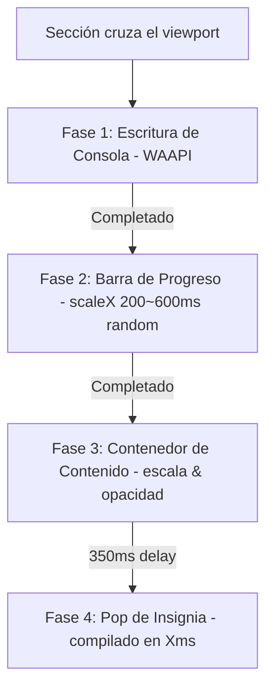

# TecnoDespegue Landing — Core Engine

> Plataforma corporativa y vitrina de ingeniería para **TecnoDespegue** — Agencia boutique de ingeniería de software a medida, desarrollo web/móvil, arquitecturas distribuidas y automatizaciones cognitivas con Inteligencia Artificial.

[](https://astro.build/)
[](https://tailwindcss.com/)
[](https://www.typescriptlang.org/)
[](https://pagespeed.web.dev/)
[](LICENSE)

---

## ⚡ Rendimiento & Core Web Vitals (Producción)

Diseño enfocado a la velocidad absoluta de renderizado, optimización de CPU y consumo mínimo de red. Logrado sin dependencias de frameworks Javascript pesados del lado del cliente, sin SSR obligatorio y con cero bloqueos del hilo principal.

| Métrica | Auditoría Móvil (PageSpeed) | Calificación GSC |
|---------|-----------------------------|------------------|
| **Performance Score** | 🟢 **99 / 100** | Excelente |
| **First Contentful Paint (FCP)** | **0.8 s** | Excelente |
| **Largest Contentful Paint (LCP)** | **1.5 s** | Excelente |
| **Total Blocking Time (TBT)** | **0 ms** | Excelente (Bloqueo Cero) |
| **Cumulative Layout Shift (CLS)** | **0** | Sin saltos visuales |
| **SEO & Accesibilidad** | **100 / 100** | Aprobado WCAG 2.1 AA |

### Estrategias de Optimización Implementadas:
*   **Fonts Preloading & Swap Isolation**: Declaración explícita de tipografías variables locales (`Space Grotesk Variable` e `Inter Variable`) con `font-display: optional`. Precarga directa de archivos `.woff2` desde la cabecera del documento para eliminar el reflow y obtener un CLS absoluto de `0`.
*   **CSS Chunk Consolidator**: Agrupación automática de todo el árbol de dependencias de estilos en un único archivo de carga consolidado (`cssCodeSplit: false`), eliminando solicitudes HTTP en cascada.
*   **Non-Blocking Analytics**: Analítica de Plausible diferida de forma reactiva escuchando el evento `window.load` y ejecutada mediante `requestIdleCallback` para no interferir en la carga inicial (LCP).
*   **Aceleración por GPU en Capa Visual**: Animaciones cinemáticas y transformaciones geométricas del cursor e interfaces restringidas al compositor gráfico (`transform` y `opacity`) utilizando propiedades `will-change` controladas.
*   **Lectura de Scroll Eficiente**: El monitor de la barra de progreso y las animaciones de scroll operan mediante escuchas pasivas (`passive: true`) y las lecturas del viewport están sincronizadas mediante `requestAnimationFrame`.

---

## 🪐 Mecánica Visual e Interactiva

El sitio utiliza una estética cyberpunk/sci-fi editorial ("The Neon Architect") caracterizada por su profundidad atmosférica, geometrías orbitantes en 3D y secuencias interactivas que narran de manera activa lo que hacemos:

### 1. Mapa de Convergencia Tecnológica (Hero 3D Gyroscope)
Ubicado en el primer impacto visual de la landing. Consta de tres especialidades representadas como nodos interactivos rodeando a un giroscopio tridimensional:
*   **Nodo Software (Cian)**: Representa el stack fullstack web & mobile.
*   **Nodo Sistemas IA (Verde)**: Representa los agentes autónomos de IA y flujos cognitivos.
*   **Nodo IoT & Solar (Oro)**: Representa la especialización física en domótica, electricidad y sistemas solares fotovoltaicos.
*   **SVG Connection Circuitry**: Líneas vectoriales dinámicas dibujadas con SVG que transportan impulsos continuos de luz neón (`stroke-dashoffset`) desde los nodos hacia el giroscopio central.
*   **Giroscopio 3D CSS**: Tres anillos concéntricos inclinados y rotando en ejes geométricos independientes (`rotateX`, `rotateY`, `rotateZ`) con perspectiva espacial `1000px` y estilo de preservación 3D nativo, simulando el motor de ejecución TecnoDespegue.

### 2. Orquestador de Compilación en 4 Fases (`CompileReveal.astro`)
En lugar de revelados genéricos por scroll, cada sección se introduce dinámicamente simulando un flujo secuencial de compilación cuando entra en el viewport:



*   **Fase 1 (Terminal Import)**: Escribe carácter por carácter en sintaxis legible en español la ruta de importación de la sección (`> importando { Servicios } desde '@components'`) mediante la API de Animación Web nativa (WAAPI).
*   **Fase 2 (Progress Track)**: Ejecuta una barra de carga verde neón horizontal que se escala de `0 -> 1` basándose en un retraso de cálculo aleatorio e independiente calculado en tiempo de ejecución (200ms–600ms).
*   **Fase 3 (Content Mount)**: Revela fluidamente la sección con transformaciones de escala suavizadas (`scale(0.97 -> 1)`) y desvanecido de opacidad.
*   **Fase 4 (Pop de Insignia)**: Hace aparecer con una física de resorte (*spring physics*) una insignia de confirmación técnica que expone la latencia del build simulado: `✓ compilado en {X}ms`.
*   **A11y Degraded Mode**: El componente detecta y respeta la bandera de accesibilidad del sistema operativo `prefers-reduced-motion: reduce`, salteando todas las fases de la terminal para renderizar el contenido de forma instantánea.

---

## 🛠️ Arquitectura de Archivos

```
tecnodespegue-landing/
├── src/
│   ├── components/
│   │   ├── Hero.astro            # Título secuencial, terminal config, giroscopio y nodos interactivos
│   │   ├── TrustSignals.astro    # Métricas y señales de confianza (15+ proyectos, Cloud/OpenSource)
│   │   ├── Services.astro        # Bloques: IA, Web & Mobile, Software & APIs, Optimización
│   │   ├── Refactor.astro        # Auditoría e interactivo simulador de optimización (Green sweep laser)
│   │   ├── Portfolio.astro       # 6 proyectos reales con links de GitHub, producción y stacks
│   │   ├── Why.astro             # Diferenciadores + mockup de consola ejecutando pruebas unitarias
│   │   ├── Testimonials.astro    # Casos de éxito con testimonios reales y métricas del proyecto
│   │   ├── Tech.astro            # Catálogo interactivo de arsenal tecnológico (React, Python, n8n, etc.)
│   │   ├── CTA.astro             # Call to Action principal con agendamientos y acceso a WhatsApp
│   │   ├── ContactForm.astro     # Formulario de contacto integrado con Formspree y fallback local
│   │   ├── Nav.astro             # Navegación flotante superior con efecto glassmorphic
│   │   ├── Footer.astro          # Enlaces directos, redes sociales, ubicación y firma corporativa
│   │   ├── CompileReveal.astro   # Contenedor visual del orquestador de compilación en 4 fases
│   │   ├── CompileBadge.astro    # Insignia física con pop de resorte indicando milisegundos de build
│   │   ├── ScrollReveal.astro    # Animación clásica de scroll suave para elementos sobre el pliegue
│   │   └── CustomCursor.astro    # Control del cursor dinámico acelerado por GPU
│   ├── layouts/
│   │   └── Layout.astro          # Esqueleto HTML5, metadatos SEO, OpenGraph, Schema JSON-LD y preloads
│   ├── pages/
│   │   ├── index.astro           # Página principal y orquestador de componentes
│   │   ├── 404.astro             # Página de error 404 personalizada con CTAs reactivos (noindex)
│   │   └── privacidad.astro      # Política de privacidad alineada a Ley 25.326 y RGPD
│   ├── scripts/
│   │   ├── heroScript.ts         # Motor typewriter secuencial para el H1 principal
│   │   └── compileReveal.ts      # Manejador asíncrono e IntersectionObserver de las 4 fases
│   └── styles/
│       └── global.css            # Hoja de estilos central, tokens Tailwind v4, fuentes y animaciones
├── public/                       # Favicons, assets vectoriales de marcas e imágenes estáticas
├── astro.config.mjs              # Configuración del motor Astro (sitemap, HTML minification)
├── vercel.json                   # Enrutador, redirecciones y alias canonicals para GSC (/sitemap.xml)
└── package.json                  # Definición de dependencias y scripts de construcción
```

---

## 🚀 Entorno de Desarrollo Local

El proyecto está diseñado bajo un ecosistema moderno y de alto rendimiento.

**Requisitos previos mínimos**: Node.js >= 22.12.0 (LTS recomendado).

```bash
# 1. Clonar el repositorio
git clone https://github.com/Rene-Kuhm/tecnodespegue-landing.git
cd tecnodespegue-landing

# 2. Instalar dependencias
npm install

# 3. Iniciar servidor de desarrollo local
npm run dev
# → El servidor se inicializará en http://localhost:4321/

# 4. Generar el compilado estático para producción
npm run build

# 5. Previsualizar localmente el build estático generado
npm run preview
```

---

## 📦 Estrategia de Despliegue en Producción

### Despliegue Cloud (Vercel — Recomendado)
El proyecto está optimizado con configuraciones de caché de cabecera y enrutamiento en Vercel. 
Para lanzar un deploy directo a producción con CLI:
```bash
npx vercel --prod
```

### Contenerización Docker (Self-Hosted / Servidor Privado)
Se incluye un Dockerfile optimizado en múltiples etapas (*multi-stage build*) para compilar estáticamente el proyecto utilizando Node y servirlo mediante un servidor ultra-liviano **Nginx Alpine**.

#### Dockerfile de Producción:
```dockerfile
# Etapa 1: Compilación de recursos
FROM node:22-alpine AS build
WORKDIR /app
COPY package*.json ./
RUN npm ci
COPY . .
RUN npm run build

# Etapa 2: Servidor Web Estático optimizado
FROM nginx:alpine
COPY --from=build /app/dist /usr/share/nginx/html
EXPOSE 80
CMD ["nginx", "-g", "daemon off;"]
```

#### Comandos de Construcción & Ejecución:
```bash
# Construir la imagen Docker
docker build -t tecnodespegue-landing .

# Ejecutar el contenedor mapeando el puerto HTTP 80
docker run -d -p 80:80 --name tecnodespegue-landing-container tecnodespegue-landing
```

---

## 📈 Cumplimiento Google Search Console & SEO Técnico
*   **URLs Canónicas**: Generación dinámica en el head para prevenir problemas de indexación por duplicados en `www` o HTTP simple.
*   **Rutas de Sitemap**: Mapeo y reescritura estática en `vercel.json` para responder a `/sitemap.xml` directamente desde `/sitemap-index.xml`.
*   **Metadatos Enriquecidos**: Integración de marcado JSON-LD nativo estructurado para facilitar la visualización en los resultados de Google (SERP).
*   **Vulnerabilidades**: Auditoría de dependencias al 100% limpia para código de producción.

---

## 💾 Integración con Engram (Memoria Persistente)
Toda la documentación técnica, historial de desarrollo, decisiones de arquitectura y parches del sistema están integrados en tu base de datos de conocimiento local de **Engram** (`~/.engram/engram.db`), permitiendo a agentes inteligentes futuros (y a ti mismo) acceder inmediatamente al contexto semántico e histórico del proyecto:

```bash
# Ver historial del proyecto engram
engram context tecnodespegue-landing

# Buscar memorias sobre la arquitectura del Hero
engram search "cinematic-hero" --project tecnodespegue-landing
```

---

## 📝 Licencia

Este proyecto está bajo la licencia MIT. Consulta el archivo [LICENSE](LICENSE) para más detalles.

MIT © 2026 **TecnoDespegue** · René Kuhm
La Pampa, Argentina.
