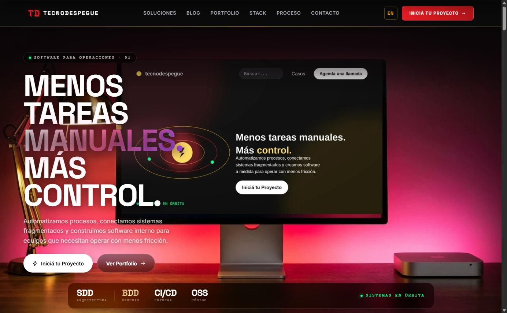
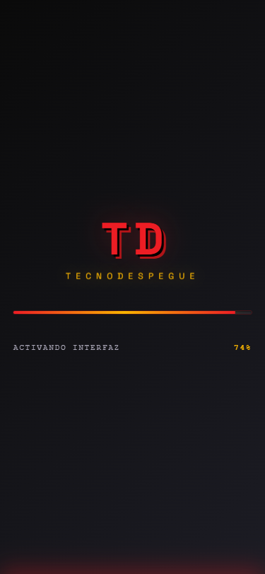
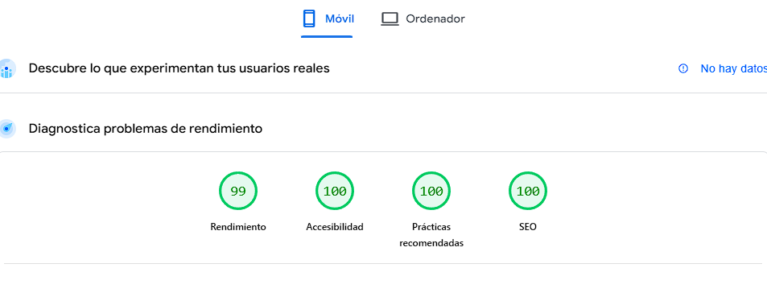
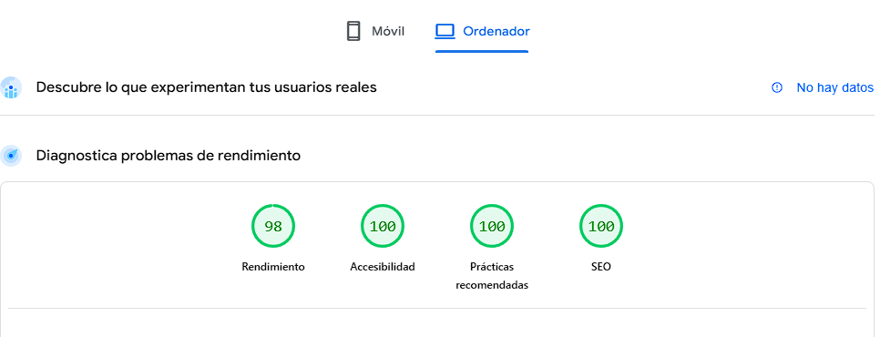

# TecnoDespegue

> Sitio web corporativo de **TecnoDespegue** — desarrollo fullstack, automatizaciones con IA y experiencias digitales que escalan tu negocio.



---

<p align="center">
  <a href="https://www.tecnodespegue.com/"></a>
  <a href="./LICENSE"></a>
  
  
  
  
</p>

<p align="center">
  
  
  
  
  
  
</p>

---

## ✨ Vista previa

| Desktop (`≥768px`) | Mobile (`<768px`) |
|:---:|:---:|
|  |  |
| Mockup cinemático con animaciones GSAP, mouse parallax, glassmorphism | Variante optimizada con tipografía protagonista, CTAs full-width, sin JS |

---

## 🎯 Acerca del proyecto

**TecnoDespegue** es una consultora boutique de ingeniería de software con base en Argentina. Este repositorio contiene su sitio web institucional con:

- **Landing cinemática** — hero estilo Marvel con monitor mockup y animaciones GSAP
- **Blog técnico** — 5 artículos sobre desarrollo, IA, performance y arquitectura
- **Casos de estudio bilingües** — contenido tipado con evidencia, decisiones y limitaciones explícitas
- **Formulario de contacto** integrado con Formspree
- **Embudo de conversión** con eventos de Plausible y tracking de TikTok

El sitio está **totalmente estático** (16 páginas prerenderizadas) con dos endpoints serverless en Vercel (`/api/og` para OG images dinámicas).

---

## 🧱 Tech Stack

### Core
| Capa | Tecnología | Versión |
|---|---|---|
| Framework | [Astro](https://astro.build) | 6.4.4 |
| Lenguaje | TypeScript | 5.9 |
| Styling | Tailwind CSS + CSS Modules | 4.3 |
| Hosting | Vercel (Serverless) | — |

### UI / Animaciones
| Librería | Uso |
|---|---|
| [GSAP](https://gsap.com) 3.15 | Timeline principal + ScrollTrigger |
| [Lenis](https://lenis.darkroom.engineering) 1.3 | Smooth scroll con bridge a GSAP |
| [Three.js](https://threejs.org) 0.184 | Efectos 3D (portal de partículas en el hero) |
| [Lucide Icons](https://lucide.dev) | Iconografía consistente (vía componente `Icon.astro`) |

### Integraciones
- **@astrojs/vercel** 10 — adapter con funciones serverless
- **@astrojs/sitemap** 3.7 — sitemap automático
- **@vercel/og** — generador de OG images on-demand

### Tooling
- **npm overrides** para forzar `path-to-regexp@^8` (mitigación de CVE HIGH)
- **scripts/check-deploy.mjs** — validación pre-deploy cross-platform
- **PowerShell + bash** compatibles

---

## 📊 Performance & Quality

Auditado con **[PageSpeed Insights](https://pagespeed.web.dev/?url=https%3A%2F%2Fwww.tecnodespegue.com%2F)** (Lighthouse 13.3.0, Moto G Power emulado, 4G slow, último audit: 8 jun 2026):

| Categoría | Desktop | Mobile (4G slow) |
|---|:---:|:---:|
| ⚡ **Performance** | **99** / 100 | **98** / 100 |
| ♿ **Accessibility** | **100** / 100 | **100** / 100 |
| ✅ **Best Practices** | **100** / 100 | **100** / 100 |
| 🔍 **SEO** | **100** / 100 | **100** / 100 |

| Core Web Vital | Desktop | Mobile (4G slow) | Target |
|---|:---:|:---:|:---:|
| FCP (First Contentful Paint) | 1.4s | 1.4s | < 1.8s 🟢 |
| LCP (Largest Contentful Paint) | 1.7s | 1.7s | < 2.5s 🟢 |
| TBT (Total Blocking Time) | 60ms | 60ms | < 200ms 🟢 |
| CLS (Cumulative Layout Shift) | 0 | 0 | < 0.1 🟢 |
| Speed Index | 2.5s | 2.5s | < 3.4s 🟢 |

| | Mobile (Moto G Power) | Desktop |
|:---:|:---:|:---:|
| |  |  |

### Optimizaciones aplicadas

**Imagen**
- Hero `WebP`/`AVIF` con `<picture>` y `fetchpriority="high"` (preload en desktop) — LCP a 1.7s
- Versión mobile dedicada (`hero-mockup-mobile.webp` 24KB @ 800×536) separada de la desktop (4K ultrawide `.webp` 153KB @ 3840×1646)
- Vercel Image Service habilitado para optimización on-the-fly
- Art direction por breakpoint: versión 21:9 (ultrawide) servida vía `<picture><source media="(min-aspect-ratio: 17/9)">`

**CSS**
- Critical CSS inline (`inlineStylesheets: 'auto'`) — elimina render-blocking en el critical path
- Tailwind CSS v4 con `cssCodeSplit: false` (1 sola request, menor overhead)
- Sin polyfills innecesarios (target: navegadores modernos)

**JavaScript**
- Astro static-first: solo ~62KB de JS en home (Lenis smooth scroll + GSAP + scripts de componentes)
- Componentes interactivos cargan con `client:idle` cuando aplica
- TikTok Pixel carga con `defer` + `requestIdleCallback` (no bloquea LCP)
- `prefers-reduced-motion` honrado en todas las animaciones

**Fonts**
- `@fontsource-variable` (Space Grotesk + Inter) self-hosted, sin requests a Google Fonts
- `font-display: swap` en `@font-face`
- Variable fonts: 1 archivo por familia, todos los pesos

**Security headers (Best Practices 100)**
- `Strict-Transport-Security: max-age=31536000; includeSubDomains` (HSTS)
- `Content-Security-Policy` estricta con allowlist (Plausible, Formspree, Web3Forms, YouTube, Vimeo)
- `X-Content-Type-Options: nosniff`, `X-Frame-Options: SAMEORIGIN`, `Referrer-Policy: strict-origin-when-cross-origin`
- `Permissions-Policy` deshabilitando APIs innecesarias
- Cookies admin: `HttpOnly` + `Secure` + `SameSite=Strict`
- Passwords hasheados con `scrypt` + salt, sesiones firmadas con `HMAC-SHA256`
- Rate limiting en login (5 intentos / 15min por IP)

**SEO (100)**
- `sitemap-index.xml` con hreflang `es-AR` / `en-US` (excluye `/admin/`, `/404`)
- `robots.txt` con allowlist para AI crawlers (OAI-SearchBot, PerplexityBot, ClaudeBot, GPTBot)
- `llms.txt` para AI search engines (ChatGPT, Perplexity)
- Structured data JSON-LD: `Organization`, `ProfessionalService`, `BlogPosting` por post
- Open Graph + Twitter Cards por página
- `lang` declarado, `hreflang` alternates, canonical URLs, viewport meta

---

## 🚀 Quick Start

### Requisitos
- **Node.js 22.x** (recomendado) o 20.x+
- **npm 10+** o pnpm

### Instalación

```bash
# 1. Clonar
git clone https://github.com/Rene-Kuhm/tecnodespegue-landing.git
cd tecnodespegue-landing

# 2. Instalar dependencias
npm install

# 3. Configurar variables de entorno
cp .env.example .env
# Editar .env con tus valores

# 4. Dev server
npm run dev          # → http://localhost:4321

# 5. Build producción
npm run build        # genera .vercel/output/

# 6. Pre-deploy check
node scripts/check-deploy.mjs

# 7. Preview local
npm run preview
```

---

## ⚙️ Configuración

Toda la config del sitio vive en **`src/config/site.config.ts`** con fallbacks a `import.meta.env.PUBLIC_*`.

| Variable | Descripción | Default |
|---|---|---|
| `PUBLIC_SITE_URL` | Dominio principal (https) | `https://www.tecnodespegue.com` |
| `PUBLIC_SITE_HOSTNAME` | Hostname para OG / sitemap | `www.tecnodespegue.com` |
| `PUBLIC_CONTACT_EMAIL` | Email de contacto | `renekuhm2@gmail.com` |
| `PUBLIC_CONTACT_PHONE` | Teléfono (display) | `+54-9-2334-409838` |
| `PUBLIC_WHATSAPP_NUMBER` | WhatsApp (sin + ni espacios) | `5492334409838` |
| `PUBLIC_FORMSPREE_ENDPOINT` | Formspree URL | `https://formspree.io/f/mojpnepv` |
| `PUBLIC_TIKTOK_PIXEL_ENABLED` | `true` / `false` | `true` |
| `PUBLIC_TIKTOK_PIXEL_ID` | TikTok Pixel ID | `D8AARK3C77U6KT5BPNHG` |
| `PUBLIC_PLAUSIBLE_ENABLED` | `true` / `false` | `true` |
| `PUBLIC_PLAUSIBLE_DOMAIN` | Dominio en Plausible | `www.tecnodespegue.com` |

> 💡 **En Vercel:** Settings → Environment Variables → overridear las que necesites.

---

## 📁 Estructura

```
tecnodespegue-landing/
├── astro.config.mjs             # Config Astro (Vercel adapter, Tailwind)
├── vercel.json                  # Security headers + redirects
├── package.json
├── tsconfig.json
├── .env.example                 # Template de variables de entorno
├── docs/                        # 📸 Screenshots para README
│   ├── hero-desktop.png
│   └── hero-mobile.png
├── public/                      # Assets estáticos
│   ├── hero-mockup.webp         # LCP image (47KB)
│   ├── hero-mockup.jpg          # Fallback JPEG (73KB)
│   ├── favicon.svg
│   ├── og-image.png
│   ├── robots.txt
│   ├── site.webmanifest
│   └── _astro/                  # Analytics loaders (TikTok, Plausible)
├── scripts/
│   └── check-deploy.mjs         # Validación pre-deploy
└── src/
    ├── components/              # Componentes Astro
    │   ├── Nav.astro
    │   ├── Hero.astro              ← hero responsive unificado
    │   ├── TrustSignals.astro
    │   ├── Services.astro
    │   ├── Portfolio.astro
    │   ├── Refactor.astro
    │   ├── Why.astro
    │   ├── Tech.astro
    │   ├── CTA.astro
    │   ├── Footer.astro
    │   ├── PageTransition.astro
    │   ├── ProgressBar.astro
    │   ├── CustomCursor.astro
    │   ├── BlogHero.astro
    │   ├── TableOfContents.astro
    │   ├── RelatedPosts.astro
    │   ├── Newsletter.astro
    │   ├── ScrollReveal.astro
    │   ├── CompileReveal.astro
    │   ├── CompileBadge.astro
    │   └── Icon.astro
    ├── config/
    │   └── site.config.ts       # Config centralizada
    ├── content/                 # Markdown collections
    │   ├── case-studies/        # Casos ES/EN con evidencia y límites
    │   └── posts/               # 5 blog posts
    ├── content.config.ts        # Schemas tipados: posts y caseStudies
    ├── layouts/
    │   └── Layout.astro         # HTML shell + meta + JSON-LD
    ├── pages/
    │   ├── index.astro          # Home
    │   ├── 404.astro
    │   ├── privacidad.astro
    │   ├── api/
    │   │   └── og.ts            # OG image generator (Vercel)
    │   ├── blog/
    │   │   ├── index.astro
    │   │   └── [slug].astro
    ├── scripts/
    │   ├── analytics/
    │   │   ├── tiktok-pixel-loader.js
    │   │   └── plausible-loader.js
    │   ├── three/               # Three.js helpers
    │   ├── animations/          # GSAP + Lenis
    │   └── heroScript.ts
    ├── styles/
    │   └── global.css           # Sistema de diseño Marvel
    └── utils/
        └── blog.ts
```

---

## 🚢 Deploy a Vercel

### Opción 1: GitHub integration (recomendada)

1. Push a GitHub
2. Vercel → **New Project** → Import repo
3. Configurar:
   - **Framework Preset:** Astro (auto-detectado)
   - **Build Command:** `npm run build`
   - **Output Directory:** `.vercel/output/static` (auto)
4. **Environment Variables** en Settings → agregar las que necesites override
5. **Domains** → agregar `tecnodespegue.com` + `www.tecnodespegue.com`
6. **Enforce HTTPS** ✅
7. Deploy automático en cada push a `main`

### Opción 2: Vercel CLI

```bash
npm i -g vercel
vercel login
vercel link
vercel env add PUBLIC_SITE_URL production
# ... repetir para cada variable
vercel --prod
```

---

## 🛡️ Seguridad

Headers aplicados vía `vercel.json`:

| Header | Valor | Propósito |
|---|---|---|
| `Strict-Transport-Security` | `max-age=31536000; includeSubDomains; preload` | Forzar HTTPS, preloadeable |
| `Content-Security-Policy` | `default-src 'self'`, `frame-ancestors 'self'`, `object-src 'none'` | Anti-XSS, anti-clickjacking |
| `X-Frame-Options` | `SAMEORIGIN` | Anti-clickjacking |
| `X-Content-Type-Options` | `nosniff` | Anti-MIME-sniffing |
| `Referrer-Policy` | `strict-origin-when-cross-origin` | Limitar referrer leaks |
| `Permissions-Policy` | `camera=(), geo=(), mic=(), payment=(), ...` | Deshabilitar APIs sensibles |
| `Cross-Origin-Opener-Policy` | `same-origin` | Anti-Spectre |
| `Cross-Origin-Resource-Policy` | `same-origin` | Anti-embedding |
| `Cross-Origin-Embedder-Policy` | `credentialless` | Cross-origin isolation |

### Auditoría

```bash
$ npm audit --omit=dev
found 0 vulnerabilities
```

- **0 vulnerabilidades** en production dependencies
- **path-to-regexp HIGH CVE** mitigado con `npm overrides` → forzado a `^8.0.0`
- **0 secrets** en el HTML generado
- **0 scripts cross-origin** externos (todo self-hosted, no necesita SRI)
- **0 subdominios inseguros** (api/admin/dev/etc → NXDOMAIN)
- **0 mixed-content** (sin `http://` en el HTML)

---

## ♿ Accesibilidad

- ✅ `prefers-reduced-motion` respetado globalmente (apaga animaciones decorativas)
- ✅ `aria-hidden` en decoraciones
- ✅ Skip-link al contenido principal
- ✅ Semantic HTML5 (`<nav>`, `<main>`, `<article>`, `<section>`)
- ✅ Contraste WCAG AA en toda la paleta
- ✅ `font-display: swap` (no flash of invisible text)
- ✅ Keyboard navigation completa
- ✅ Touch targets ≥48px en mobile
- ✅ `lang="es"` en `<html>`

---

## 📝 Comandos

| Comando | Acción |
|---|---|
| `npm run dev` | Dev server con HMR (puerto 4321) |
| `npm run build` | Build producción a `.vercel/output/` |
| `npm run preview` | Preview local del build |
| `npm run astro` | CLI de Astro |
| `node scripts/check-deploy.mjs` | Pre-deploy check (15 validaciones) |

---

## 🗺️ Roadmap

- [x] Landing cinemática con hero mockup
- [x] Hero mobile dedicado (LCP optimizado)
- [x] Blog técnico con búsqueda + filtros + TOC
- [x] OG images dinámicas con `@vercel/og`
- [x] Formulario de contacto con Formspree
- [x] TikTok Pixel + Plausible Analytics
- [x] PageSpeed 99/100 desktop, 100/100 SEO/A11y/BP
- [x] Path-to-regexp CVE mitigado
- [x] Cross-origin isolation headers
- [ ] RSS feed del blog
- [ ] Multi-idioma (i18n EN/ES)
- [ ] Dark/Light theme toggle

---

## 🤝 Contribuir

Si querés sugerir cambios:

1. Fork el repo
2. Creá una branch (`git checkout -b feature/mi-mejora`)
3. Commiteá tus cambios (`git commit -m 'feat: add mi mejora'`)
4. Push a la branch (`git push origin feature/mi-mejora`)
5. Abrí un Pull Request

Convención de commits: [Conventional Commits](https://www.conventionalcommits.org/) — `feat:`, `fix:`, `perf:`, `docs:`, `style:`, `refactor:`, `test:`, `chore:`.

---

## 🐛 Troubleshooting

### "Cannot find siteConfig" después de cambiar config
Reiniciá el dev server: `Ctrl+C` y `npm run dev` de nuevo.

### OG image no se genera
- Verificá que `@vercel/og` esté en dependencies
- El endpoint `/api/og` requiere Node 18+ (default en Vercel)
- Los OG dinámicos solo funcionan en deploy, no en build estático

### Mobile LCP alto
- Verificá que `<link rel="preload" as="image" href="/hero-mockup.webp">` esté en el `<head>`
- El LCP idealmente < 2.5s. Si > 3s en mobile, considera self-hosting más assets

### Build error con `path-to-regexp`
- El override `^8.0.0` en `package.json` debe estar presente
- Borrá `node_modules` + `package-lock.json` y reinstalá

---

## 📜 Licencia

[MIT](./LICENSE) © 2026 TecnoDespegue

---

## 📬 Contacto

- **Web:** [tecnodespegue.com](https://www.tecnodespegue.com/)
- **Email:** [renekuhm2@gmail.com](mailto:renekuhm2@gmail.com)
- **WhatsApp:** [+54 9 2334 409838](https://wa.me/5492334409838)
- **GitHub:** [@Rene-Kuhm](https://github.com/Rene-Kuhm)
- **LinkedIn:** [rene-kuhm](https://linkedin.com/in/rene-kuhm)

---

<p align="center">
  <strong>Hecho por <a href="https://www.tecnodespegue.com/">René Kuhm</a></strong>, creador de <a href="https://www.tecnodespegue.com/">www.tecnodespegue.com</a>
  <br><br>
  Hecho con ❤️ y ☕ en Argentina
  <br>
  <sub>Powered by <a href="https://astro.build">Astro</a> · Deployed on <a href="https://vercel.com">Vercel</a></sub>
</p>
